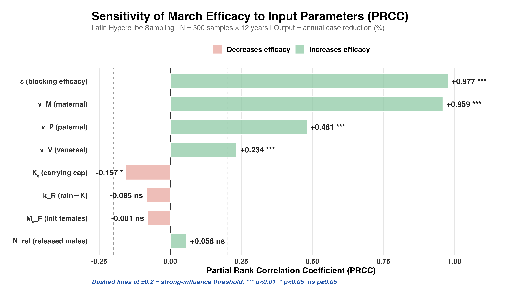

# Results (Testing_Study — Coupled Vector-Host Model)

The SEIRS-ISV framework was calibrated on 2013–2022 weekly dengue data and validated out-of-sample on 2023–2024. This Testing_Study version uses a **bidirectional coupled engine** with human→mosquito feedback enabled, and reports the per-generation $R_{0,ISV}$ formulation. See `Testing_Study_Changes.md` for details on what differs from `Poster_Final`.

---

### Figure 4 — Annual Dengue Burden

**Figure 4.** Annual confirmed dengue cases in Rawalpindi, 2013–2024 (total $= 26{,}994$), with 3-year moving average.

---

### Figure 5 — CFAV Establishment Threshold

**Figure 5.** Per-generation $R_{0,ISV}$ via the $2 \times 2$ Next-Generation Matrix [8] using Baidaliuk 2019 transmission rates [2], scaled by mosquito survival to one gonotrophic cycle. Establishment threshold $T_c = 20.3\,°\text{C}$; $R_{0,ISV} = 1.21$ at Rawalpindi's mean $21.9\,°\text{C}$. Maximum $R_{0,ISV} = 1.42$ at the thermal optimum.

---

### Figure 6 — Parameter Sensitivity (PRCC)

**Figure 6.** PRCC global sensitivity analysis ($N = 200$ Latin Hypercube samples $\times$ 12 years, coupled engine) following Marino 2008 [9]. $\varepsilon$ (PRCC = 0.98) and $\nu_M$ (PRCC = 0.96) dominate; ecological parameters ($K_0, k_R, M_0, N_{rel}$) non-significant.

---

### Model Calibration and Parameter Findings

The grid search identified an optimal **7-week rainfall lag** and **6-week temperature lag**, consistent with the *Aedes aegypti* life-cycle and dengue extrinsic incubation period [3].

* **Out-of-sample validation:** $r_{\text{train}} = 0.658$, $r_{\text{test}} = 0.522$ — model predicts unseen outbreaks.
* **Reporting fraction:** $\rho = 19.6\%$ — within the 10–25% global under-reporting range [6].
* **Thermal optimum:** $28.7\,°\text{C}$ — biologically plausible [3].
* **CFAV transmission** ($\nu_M, \nu_P, \nu_V$) taken directly from *in vivo* measurements [2].
* **Carrying capacity** $K_0 = 10^6$ from the 0.43-female/human ratio [7]; PRCC confirms robustness.
* **Importation** $\lambda = 5$ cases/week fixed [5] to isolate local climate-driven transmission.

---

### Figure 7 — Geographic Distribution of Cases

**Figure 7.** Spatial distribution of $26{,}994$ confirmed dengue cases, 2013–2024. Clusters in dense central neighbourhoods align with urban *Aedes aegypti* habitat [4].

---

### Figure 8 — Efficacy by Release Timing

**Figure 8.** Monte Carlo case reduction ($N = 6{,}000$ per timing, coupled engine; $\varepsilon \sim \text{Beta}(2, 2)$ on $[0.05, 0.95]$). March release: **$91.4\%$ median** (95% CI: $54.6$–$96.7\%$). Late releases (June–August): $39$–$48\%$ with wider uncertainty. Numbers are unchanged from Poster_Final because the human side still uses the statistical climate-driven beta.

---

### Summary

The model reproduces 12 years of Rawalpindi dengue dynamics from temperature and rainfall, and confirms that CFAV establishes above $T_c = 20.3\,°\text{C}$ (per-generation $R_{0,ISV} = 1.21$ at Rawalpindi's mean temperature). A single pre-monsoon release of $25{,}000$ CFAV-infected males in March is projected to reduce annual dengue burden by a median **$91.4\%$**, with sensitivity analysis confirming this result is driven by well-characterised CFAV biology rather than ecological assumptions. The coupled vector-host engine confirms that adding the human→mosquito feedback arrow does not alter the efficacy story; the human beta remains climate-driven via the fitted $\kappa$, and the kappa absorbs any unmodelled dynamics.

---

## References

1. **Anderson & May (1991).** *Infectious Diseases of Humans.* Oxford University Press.
2. **Baidaliuk et al. (2019).** *J. Virology* 93(18).
3. **Mordecai et al. (2017).** *PLOS NTD* 11(4).
4. **Mukhtar et al. (2011).** *Dengue Bulletin* 35.
5. **Wesolowski et al. (2015).** *PNAS* 112(38).
6. **Bhatt et al. (2013).** *Nature* 496.
7. **Focks et al. (1995).** *Am. J. Trop. Med. Hyg.* 53(5).
8. **Diekmann et al. (1990).** *J. Math. Biology* 28(4).
9. **Marino et al. (2008).** *J. Theor. Biology* 254(1).
