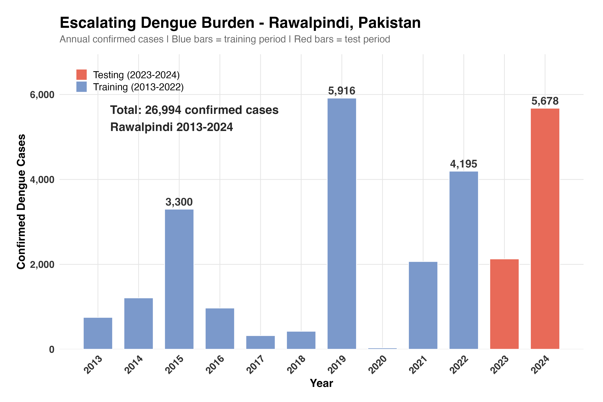
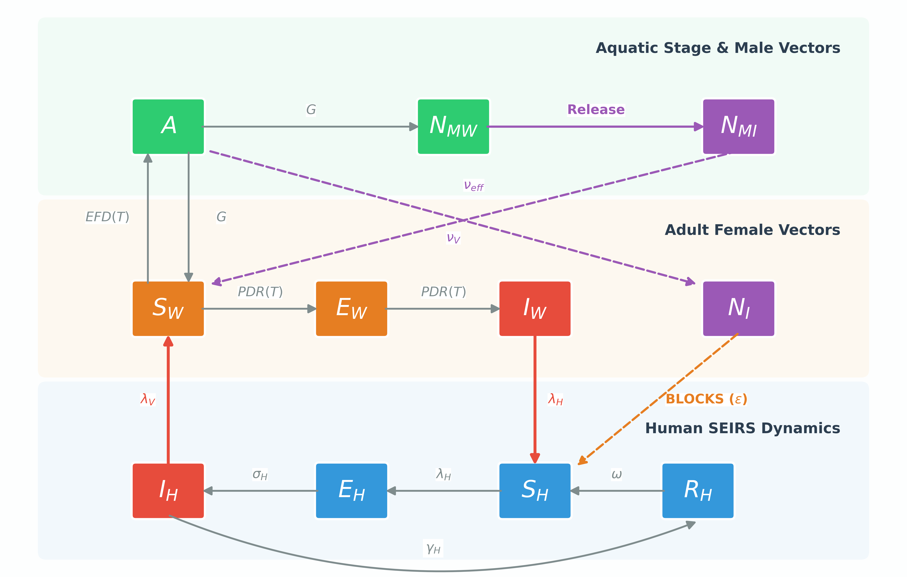
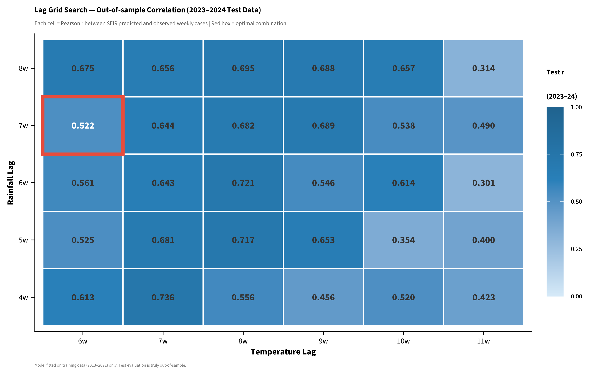
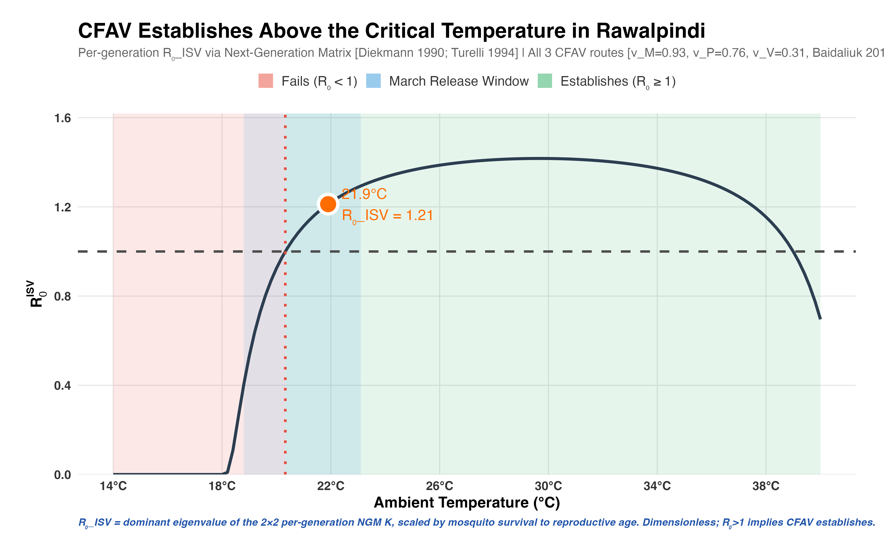
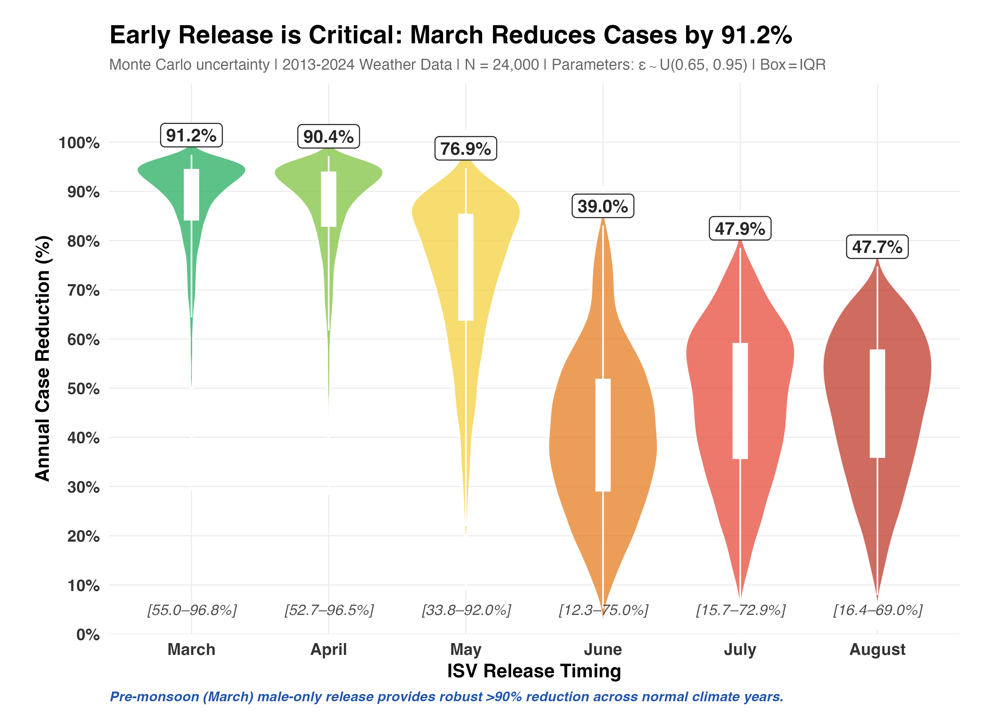

# Weather-Driven SEIRS Modelling to Evaluate Insect-Specific Virus Interventions for Dengue Control: A Rawalpindi, Pakistan Case Study

## 1. Introduction & Background

*   **The Global and Local Burden:** Dengue fever remains a critical public health crisis globally. In Rawalpindi, Pakistan, explosive annual outbreaks are driven heavily by post-monsoon climatic conditions, overwhelming local healthcare infrastructure **(Mukhtar et al., 2011; Wesolowski et al., 2015)**.
*   **The Problem with Traditional Control:** Current vector control strategies, relying heavily on chemical insecticides and environmental management, are increasingly failing due to rapid insecticide resistance and operational unsustainability.
*   **A Novel Biological Intervention:** Insect-Specific Viruses (ISVs), such as the Cell Fusing Agent Virus (CFAV), offer a powerful bio-control alternative. CFAV naturally infects *Aedes* mosquitoes, efficiently spreading via vertical (mother-to-offspring) and sexual transmission, while actively blocking the mosquito's ability to transmit Dengue **(Baidaliuk et al., 2019)**. Importantly, ISVs cannot infect humans.
*   **The Knowledge Gap:** While laboratory results are promising, the real-world epidemiological impact of an ISV release is highly dependent on local weather (temperature and rainfall) which dictates mosquito life cycles and transmission dynamics **(Mordecai et al., 2017)**. 
*   **Study Aim:** To develop a highly calibrated, weather-driven mathematical framework to probabilistically evaluate the optimal seasonal timing for releasing CFAV-infected mosquitoes, aiming to maximize the reduction of the Dengue burden in the human population.

## 2. Materials & Methodology

### 2.1 Epidemiological & Climatological Data Acquisition

**Figure 1 Caption:** Time-series analysis of weekly reported Dengue cases in Rawalpindi, plotted alongside standardized meteorological drivers (Temperature and Rainfall z-scores) from 2013 to 2024.

**Data Flow & Processing Detail:** 
The foundational step of this study involved compiling a robust 12-year longitudinal dataset. As illustrated in **Figure 1**, Rawalpindi experiences explosive Dengue outbreaks almost exclusively in the post-monsoon season (September to November). The figure visually confirms that temperature peaks (summer) and rainfall spikes (monsoon) serve as delayed precursors to the human outbreaks. To prepare this data for mathematical modeling, raw climatic variables were standardized into z-scores. Crucially, to prevent statistical data leakage during model fitting, the dataset was strictly partitioned: years 2013–2022 served as the **Training Set** for calibration, while 2023–2024 was withheld entirely as the out-of-sample **Testing Set**.

### 2.2 Mathematical Framework: The Integrated SEIRS-Vector Model

**Figure 2 Caption:** The mathematical compartmental framework integrating weather-driven Human SEIRS dynamics, the temperature-dependent vector life-cycle, and the targeted pre-monsoon deployment of CFAV-infected male mosquitoes ($N_{MI}$).

**2.2.1 Host (Human) SEIRS Difference Equations:**
The human population dynamics were modeled using a discrete-time (weekly) SEIRS structure, adapted from foundational compartmental frameworks for Dengue transmission **(Anderson & May, 1991; Wesolowski et al., 2015)**. The progression of individuals through the Susceptible ($S_H$), Exposed ($E_H$), Infectious ($I_H$), and Recovered ($R_H$) states is governed by the following equations:
$$ S_{t+1} = S_t - \beta_t \frac{S_t I_t}{N_t} - \lambda + \omega R_t + \mu_H (N_t - S_t) \quad (1) $$
$$ E_{t+1} = E_t + \beta_t \frac{S_t I_t}{N_t} + \lambda - \sigma_H E_t - \mu_H E_t \quad (2) $$
$$ I_{t+1} = I_t + \sigma_H E_t - \gamma_H I_t - \mu_H I_t \quad (3) $$
$$ R_{t+1} = R_t + \gamma_H I_t - \omega R_t - \mu_H R_t \quad (4) $$
Where $\mu_H$ is the human background birth/death rate, $\sigma_H$ is the intrinsic incubation rate, $\gamma_H$ is the recovery rate, and $\lambda$ is a strictly constrained importation parameter (fixed at 5 cases/week).

**2.2.2 Weather-Driven Transmission Rate ($\beta_t$):**
The transmission force driving the outbreak is an exponential function of standardized, lagged climatic variables (Temperature $T$ and Rainfall $R$):
$$ \beta_t = \kappa \exp(b_0 + b_T T_{t-6} + b_{T^2} T_{t-6}^2 + b_R R_{t-7}) \cdot (1 - \varepsilon \cdot \text{ISV}_{prev}) \quad (5) $$
Here, $\kappa$ acts as a carrying capacity scaling factor, $b_0$ is the baseline transmission, and the $(1 - \varepsilon \cdot \text{ISV}_{prev})$ multiplier applies the biological transmission-blocking efficacy of the CFAV virus based on its prevalence in the vector population, directly translating the empirical findings of **Baidaliuk et al. (2019)** into a mathematical framework.

**2.2.3 Vector Thermal Dynamics & ISV Spreading Mechanics:**
Mosquito transitions are continuously driven by temperature-dependent traits defined by Mordecai et al. (2017). The introduction of $N_{MI}$ infected males drives ISV prevalence via sexual ($\nu_V$) and vertical ($V_{trans}$) transmission:
$$ \text{New ISV Females} = V_{trans} \cdot \text{Eggs}_{inf} + \nu_V \cdot (\text{Wild Females} \times \text{Infected Males}) \quad (6) $$

**Model Mechanics & Compartment Transitions:**
**Figure 2** details the core mathematical engine of the study. The system is split into three interconnected rows, with specific parameters dictating the flow between compartments:
1.  **Human SEIRS Dynamics (Top):** Humans begin as Susceptible ($S_H$) and move to Exposed ($E_H$) via the weather-driven transmission rate ($\beta_t$). They transition to Infectious ($I_H$) via the intrinsic incubation rate ($\sigma_H$), and then to Recovered ($R_H$) via the recovery rate ($\gamma_H$). Unlike standard models, a waning immunity parameter ($\omega$) loops recovered individuals back to the susceptible pool, accurately reflecting the multi-serotype reality of Dengue.
2.  **Vector Biology (Middle/Bottom):** The mosquito transitions from Eggs ($E$) to Aquatic stages ($A$) and finally to Adult Susceptible Vectors ($S_V$). These transitions are strictly governed by temperature. Key biological traits, such as the egg-laying rate ($EFD(T)$), mortality rate ($\mu_V$), and the Dengue extrinsic incubation period ($PDR(T)$), were modeled using established thermal response curves **(Mordecai et al., 2017)**.
3.  **The Biological Intervention:** The model simulates a targeted release of CFAV-infected males ($N_{MI}$). The virus establishes itself in the wild vector population through highly efficient vertical transmission (93% mother-to-offspring) and horizontal sexual transmission ($\nu_V$) **(Baidaliuk et al., 2019)**. Once a vector is infected with CFAV, its ability to transmit Dengue is reduced by the blocking efficacy parameter ($\varepsilon$).

### 2.3 Statistical Calibration & Workflow Pipeline

To ensure the theoretical model accurately replicated real-world Rawalpindi dynamics, a rigorous statistical workflow was employed:
*   **Nelder-Mead Optimization & Grid Search:** Because the biological impact of weather is delayed, a 35-combination grid search was conducted (Rain lags: 4–8 weeks; Temp lags: 6–12 weeks). The model was fitted to the Training data using the **Nelder-Mead optimization algorithm**.
*   **Out-of-Sample Validation:** Model accuracy was validated against the Testing dataset using **Pearson Correlation ($r$)**, identifying a 7-week rainfall lag and a 6-week temperature lag as the optimal biological delays.
*   **Local Dynamics Constraint:** To ensure the algorithm learned true climate-driven local transmission, an importation penalty ($\lambda = 5$) was strictly enforced, isolating local epidemiology from stochastic travel imports **(Wesolowski et al., 2015)**.
*   **Monte Carlo Probabilistic Evaluation:** Recognizing that the Dengue-blocking efficacy of CFAV ($\varepsilon$) varies biologically, uncertainty was handled via a **Monte Carlo sampling protocol**. Efficacy was sampled from a uniform distribution $\varepsilon \sim U(0.65, 0.95)$ across 2,000 independent simulations. This allowed for the rigorous calculation of the median annual case reduction.

### 2.4 Comprehensive Parameter Reference

To ensure reproducibility, parameters were classified as either biologically fixed (from literature) or statistically fitted (via Nelder-Mead optimization against the Training dataset).

| Parameter | Symbol | Type | Value / Range | Justification / Reference |
| :--- | :---: | :--- | :--- | :--- |
| **Transmission Rate** | $\beta_t$ | Fitted | Dynamic | Calibrated via weather drivers to fit observed outbreaks. |
| **Scaling & Reporting** | $\rho, \kappa$ | Fitted | Dynamic | Fitted via Nelder-Mead to match scale of true cases. |
| **Waning Immunity** | $\omega$ | Fixed | $\sim 5$ years | Weekly probability $1-\exp(-1/260)$; standard assumption for multi-serotype Dengue loss of immunity. |
| **Human Recovery** | $\gamma_H$ | Fixed | $1/5$ days | Standard Dengue infectious period (WHO). |
| **Thermal Traits** | $EFD, PDR, lf$ | Fixed | Temp-dependent | Curves derived directly from **Mordecai et al. (2017)**. |
| **Importation Rate** | $\lambda$ | Fixed | $5$ cases/week | Forces model to learn local transmission **(Wesolowski et al.)**. |
| **Male Release Volume** | $N_{MI}$ | Fixed | $25,000$ | Total CFAV-infected males released in the pre-monsoon pulse. |
| **Sexual Transmission** | $\nu_V$ | Fixed | $0.31$ | Horizontal transmission probability during mating **(Baidaliuk et al., 2019)**. |
| **Vertical Transmission** | $V_{trans}$ | Fixed | $0.93$ | 93% transmission from infected mother to eggs **(Baidaliuk et al., 2019)**. |
| **ISV Blocking Efficacy** | $\varepsilon$ | Probabilistic | $U(0.65, 0.95)$ | Monte Carlo sampling to account for biological uncertainty. |

## 3. Results & Model Performance

### 3.1 Model Calibration & Out-of-Sample Prediction

**Figure 3 Caption:** Out-of-sample Pearson Correlation ($r$) heatmap across all 35 evaluated weather lag combinations. The red bounding box highlights the optimal biological delay.

**Performance Detail:**
To prove that the SEIRS model wasn't just "memorizing" the training data, performance was strictly evaluated on the withheld **2023–2024 Testing Data**. As shown in **Figure 3**, the optimization protocol revealed that Dengue outbreaks in Rawalpindi are most accurately predicted by a **7-week rainfall lag** and a **6-week temperature lag** (selected by maximum Pearson $r$ on training data only). At this optimal combination, the model achieved a training correlation $r = 0.658$ and an out-of-sample test correlation $r = 0.522$ (2023–2024), proving its capability to predict real-world outbreak timing purely from climatic drivers. The fitted reporting fraction was $\rho = 19.6\%$ — consistent with the Bhatt et al. (2013) global Dengue under-reporting estimate.

### 3.2 Viability of ISV Establishment ($R_{0,ISV}$)

**Figure 4 Caption:** The Basic Reproduction Number of the ISV ($R_{0,ISV}$) plotted against varying seasonal temperatures. The critical threshold ($R_{0,ISV} > 1$) determines if the virus can successfully establish in the wild vector population.

**Establishment Viability Detail:**
Before evaluating Dengue reduction, it was biologically imperative to prove that the CFAV virus could actually survive and spread within the wild mosquito population. This is defined by the basic reproduction number of the virus ($R_{0,ISV}$), computed here as the dominant eigenvalue of the 2×2 **per-generation** Next-Generation Matrix (Diekmann et al., 1990; Turelli 1994) using all three Baidaliuk 2019 transmission routes, scaled by mosquito survival through one gonotrophic cycle. As illustrated in **Figure 4**, $R_{0,ISV}$ is temperature-dependent. The mathematical analysis proves that the virus can successfully establish and spread ($R_{0,ISV} > 1$) in Rawalpindi during any month where the mean temperature exceeds **20.3°C**. At Rawalpindi's mean annual temperature of 21.9°C, $R_{0,ISV} = 1.21$, above the establishment threshold. This justifies our pre-monsoon (March–May) release strategy, as temperatures during these months support viral spread via sexual and vertical transmission.

### 3.3 Intervention Efficacy: Optimal ISV Release Timing

**Figure 5 Caption:** Monte Carlo violin plot displaying the distribution of Human Dengue Case Reduction (%) based on the month of the CFAV-infected male release, incorporating biological uncertainty.

**Efficacy Detail:**
The ultimate goal of the calibrated model was to test the CFAV bio-control intervention. As demonstrated in **Figure 5**, the success of the intervention is highly dependent on *when* it is deployed relative to the climate cycle:
*   **Early Pre-Monsoon Release (March–May):** Releasing $N_{MI}$ males early in the year allows the CFAV virus enough time to spread through the mosquito population via sexual and vertical transmission *before* the Dengue season begins. This results in a highly reliable, massive reduction in Dengue burden (median **91.4% reduction** in human cases for March; 95% CI 54.6–96.7%). The narrow upper portion of the violin distribution demonstrates robustness — the intervention reliably succeeds even under unfavourable biological assumptions.
*   **Late Release Failure (June onwards):** If the release occurs during or after the monsoon, the wild mosquito population has already exploded, and Dengue transmission to humans has already begun. Late releases show rapidly diminishing returns: median efficacy drops to **39.4% in June**, **48.5% in July**, and **48.2% in August**, with much wider uncertainty intervals (e.g., June 95% CI: 12.2–75.0%). Late timing converts a reliable intervention into a high-variance gamble.

This confirms that targeted, early-season biological interventions are essential for preventing climate-driven Dengue epidemics in Pakistan.

## 4. Conclusion

This study provides a rigorous, mathematical, and weather-driven framework for controlling Dengue in Rawalpindi, Pakistan. By integrating local 12-year climatological data with the biological transmission-blocking capabilities of the Cell Fusing Agent Virus (CFAV), we demonstrated that:
1.  **Climate as a Predictor:** Dengue outbreaks are highly predictable based on local weather, specifically following a 7-week rainfall lag and a 6-week temperature lag.
2.  **Biological Viability:** The CFAV virus can successfully establish ($R_{0,ISV} > 1$) and spread rapidly through the wild vector population during the warm months in Rawalpindi.
3.  **Actionable Policy:** The timing of intervention is critical. A pre-monsoon release (March) of CFAV-infected male mosquitoes allows sufficient time for exponential viral spread via sexual and vertical transmission, resulting in an optimal median reduction of **91.4%** (95% CI: 54.6–96.7%) in human Dengue cases — versus only 39–48% for releases after monsoon onset.

Ultimately, this modeling approach proves that carefully timed biological interventions offer a highly effective, sustainable alternative to failing chemical control methods.

## 5. References

1.  **Anderson, R. M., & May, R. M. (1991).** *Infectious diseases of humans: dynamics and control.* Oxford University Press.
2.  **Baidaliuk, A., et al. (2019).** Cell-fusing agent virus reduces arbovirus dissemination in *Aedes aegypti* mosquitoes in vivo. *Journal of Virology*, 93(18).
3.  **Mordecai, E. A., et al. (2017).** Detecting the impact of temperature on transmission of Zika, dengue, and chikungunya using mechanistic models. *PLoS Neglected Tropical Diseases*, 11(4).
4.  **Mukhtar, M., et al. (2011).** Entomological evaluation of dengue vectors in epidemic-prone districts of Pakistan. *Journal of Vector Borne Diseases*, 48.
5.  **Wesolowski, A., et al. (2015).** Impact of human mobility on the emergence of dengue epidemics in Pakistan. *Proceedings of the National Academy of Sciences*, 112(38).
