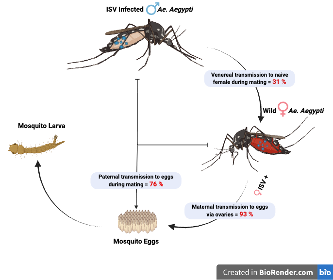

# Weather-Driven SEIRS-ISV Modelling for Dengue Control in Pakistan

> A mathematical study testing whether releasing ISV-infected male *Aedes aegypti* mosquitoes **before the monsoon** can suppress dengue outbreaks in Rawalpindi, Pakistan.
>
> **Author:** Ishtiaq Hussain — PhD candidate, Strathclyde Institute of Pharmacy & Biomedical Sciences, University of Strathclyde, Glasgow.
> **Supervisor:** Dr Valerie Odon.

---

## Headline result

A single release of **25,000 ISV-positive male *Aedes aegypti* in early March** is projected to reduce annual dengue burden in Rawalpindi by a **median 91.4 %** (95 % CI 54.6–96.7 %). The result is driven by well-measured ISV biology rather than by uncertain ecological assumptions.

---

## How to read this README

This README is written as a **step-by-step story**. Each section uses the result of the previous one. If you read it from top to bottom you will see how the model is built, why each piece is there, and how all the pieces connect to produce the final answer.

1. [The problem](#1-the-problem) — what is dengue and why is the current control strategy not enough?
2. [The idea](#2-the-idea) — what is an Insect-Specific Virus (ISV) and why might it help?
3. [The research questions](#3-the-research-questions)
4. [The data](#4-the-data)
5. [Step 1 — Finding the climate signal (lag optimisation)](#5-step-1--finding-the-climate-signal)
6. [Step 2 — Validating the model on unseen data](#6-step-2--validating-on-unseen-data)
7. [Step 3 — Building the mosquito biology](#7-step-3--building-the-mosquito-biology)
8. [Step 4 — Adding ISV vertical transmission](#8-step-4--adding-cfav-vertical-transmission)
9. [Step 5 — Closing the loop (coupled human–vector engine)](#9-step-5--closing-the-loop)
10. [Step 6 — Can ISV establish? (R₀_ISV via NGM)](#10-step-6--can-cfav-establish)
11. [Step 7 — Which parameters drive the outcome? (PRCC)](#11-step-7--which-parameters-drive-the-outcome)
12. [Step 8 — How uncertain is the answer? (Monte Carlo)](#12-step-8--how-uncertain-is-the-answer)
13. [Results — putting it all together](#13-results)
14. [Discussion and limitations](#14-discussion-and-limitations)
15. [Equations — full reference](#15-equations--full-reference)
16. [Parameter table — full reference](#16-parameter-table--full-reference)
17. [Folder structure](#17-folder-structure)
18. [How to reproduce](#18-how-to-reproduce)
19. [References](#19-references)
20. [Citation and contact](#20-citation-and-contact)

---

## 1. The problem

Dengue is a mosquito-borne viral disease that puts roughly **400 million people at risk every year**. It is transmitted primarily by *Aedes aegypti*, with a smaller contribution from *Aedes albopictus*. There is currently no universally effective vaccine.

In Pakistan, dengue is **endemic** and outbreaks peak during the monsoon (July–September) when warm temperatures and stagnant water create ideal mosquito breeding conditions. The current public-health response is **reactive**: chemical fogging and larval spraying happen *after* cases are already being reported in hospitals.

By the time hospitals notice an outbreak, the mosquito population has already exploded and people are already sick. **The reactive approach is always one step behind the mosquito.**

→ This study asks: *can we do something earlier, before the season even starts?*

---

## 2. The idea

**Insect-Specific Viruses (ISVs)** are viruses that infect mosquitoes but cannot replicate in humans or vertebrates. The ISV used in this study has two properties that make it interesting for dengue control:

1. **The ISV blocks dengue replication inside the mosquito gut.** A mosquito that already carries the ISV is much less able to transmit dengue when it later bites an infected person. This is "super-infection exclusion".
2. **The ISV spreads naturally between mosquitoes.** Infected females pass it to their eggs (maternal route). Infected males pass it through mating to either their offspring (paternal route) or the female herself (venereal route). So once the ISV is introduced into a population, it can spread on its own without ongoing intervention.

→ The intervention idea is: release ISV-carrying *Aedes aegypti* males before dengue season. They mate with wild females, the ISV spreads through the wild population by natural mating, and the mosquito population becomes much less effective at transmitting dengue by the time the outbreak season arrives.

We use only males because **only female mosquitoes bite**. Releasing extra males adds zero new biters to the city.

---

## 3. The research questions

This study answers three concrete questions:

- **Q1 — Can ISV establish in Rawalpindi's climate?** That is, will the virus self-sustain at local temperatures (R₀_ISV > 1) or die out?
- **Q2 — How many cases would a release prevent?** Quantify the reduction in annual human dengue cases for a single pre-season release.
- **Q3 — When in the year should the release happen?** Compare releases at different calendar weeks to find the optimal timing.

→ To answer these we need a model that combines climate, mosquito biology, dengue dynamics, ISV biology, and an intervention layer. The next sections build this model **step by step**.

---

## 4. The data

| File | What it contains |
|---|---|
| [`00_Data/D1_Weekly_Cases_Weather.xlsx`](./00_Data/D1_Weekly_Cases_Weather.xlsx) | Weekly confirmed dengue cases in Rawalpindi 2013–2024 merged with weekly mean temperature (°C) and rainfall (mm). |
| [`00_Data/D2_Population_2017_2023.xlsx`](./00_Data/D2_Population_2017_2023.xlsx) | Annual population estimates used to scale the human compartment N_H over time. |

The case data are **aggregated weekly counts** — no individual patient information is included.

→ With the data in hand, the first job is to find the relationship between weather and cases. That is Step 1.

---

## 5. Step 1 — Finding the climate signal

### Why look for a lag at all?

When it rains today, the dengue outbreak does **not** start tomorrow. The biological chain takes weeks:

```
Rain → containers fill → eggs hatch → larvae develop into adults → adults bite → human gets exposed → incubation period → human shows symptoms → hospital reports the case
```

Each step takes time. The total delay from a rainfall event to a reported case is several weeks. We need to know exactly how many.

Temperature has the same lag logic, but driven by adult lifespan and the dengue *extrinsic incubation period* inside the mosquito (the time the virus needs inside the mosquito before that mosquito can pass it to humans).

### How we found the optimal lag

We ran a **grid search over 35 combinations** of rainfall lag (1–7 weeks) and temperature lag (1–10 weeks), and for each combination fitted the human-side SEIRS model parameters using the **Nelder-Mead simplex algorithm**, minimising root-mean-square error against weekly case data.

Implementation: [`01_Scripts/01_SEIR_Lag_Optimization.R`](./01_Scripts/01_SEIR_Lag_Optimization.R)

### What we found

| Climate driver | Optimal lag | Biological meaning |
|---|---|---|
| Rainfall | **7 weeks** | Time for breeding-site creation, larval development to adults, and one bite-to-infection chain |
| Temperature | **6 weeks** | Tracks adult lifespan and dengue extrinsic incubation period inside the mosquito |

These lags are biologically realistic and consistent with the *Ae. aegypti* life-cycle data in Mordecai et al. 2017.

The output of this step is the **calibrated human-side β(t) function** — see Equation 2 in the [equations](#52-climate-driven-transmission-force-βt) section. This function takes today's lagged rainfall and temperature and returns today's dengue transmission strength.

→ Next, we test whether this calibrated model actually predicts unseen data. That is Step 2.

---

## 6. Step 2 — Validating on unseen data

A model that fits its own training data well is not yet useful — it might just be overfitting. The real test is whether it predicts outbreaks it has never seen.

We split the 12-year dataset:
- **Training set: 2013–2022** (10 years)
- **Held-out test set: 2023–2024** (2 years the model never saw during fitting)

Results:

| Metric | Value |
|---|---|
| Pearson r on training set (2013–2022) | **0.658** |
| Pearson r on held-out test set (2023–2024) | **0.522** |
| Fitted reporting fraction ρ | **19.6 %** (within the 10–25 % global range, Bhatt et al. 2013) |
| Fitted thermal optimum | **28.7 °C** (biologically plausible) |

The model predicts outbreaks in years it never saw during training, so we can trust it as a baseline. The reporting fraction is also in the expected global range, so our assumption that hospitals catch ~20 % of true cases is consistent with the literature.

→ With the human-side model validated, we now add explicit mosquito biology on top. That is Step 3.

---

## 7. Step 3 — Building the mosquito biology

The human side gives us "how many people get exposed each week given the weather". But to model an **intervention on mosquitoes**, we need to track the mosquitoes themselves.

We use the temperature-dependent thermal performance curves of Mordecai et al. 2017, which give us biological rates as a function of temperature:

| Function | Symbol | What it controls |
|---|---|---|
| Eggs per female per day | EFD(T) | How fast the population grows |
| Mosquito development rate | MDR(T) | How fast larvae become adults |
| Egg-to-adult survival | pEA(T) | What fraction of eggs reach adulthood |
| Adult female lifespan | lf(T) | How long an adult female lives |
| Pathogen development rate | PDR(T) | How fast dengue matures inside the mosquito |
| Biting rate | a(T) | How often a female bites |
| Per-bite transmission | c(T) | Probability a bite passes virus from human to mosquito |

All of these are implemented in [`01_Scripts/00_Thermal_Functions.R`](./01_Scripts/00_Thermal_Functions.R).

We then add **rainfall-driven carrying capacity** for the aquatic stage (eggs and larvae pooled in compartment `A`):

$$K_t = K_0 \cdot \exp(k_R \cdot R_{t-7})$$

This says the city can support more breeding sites when it rains more, with the same 7-week lag found in Step 1.

The full aquatic dynamics combine egg-laying, recruitment to adults, mortality, and density-dependent competition (Equation 3 in the [equations section](#53-aquatic-stage-eggs-and-larvae-pool-a)).

→ Now we have a working wild-mosquito model. Next we add the ISV biology layer. That is Step 4.

---

## 8. Step 4 — Adding ISV vertical transmission

ISV spreads inside the mosquito population through three biological routes, measured experimentally in *Ae. aegypti* by **Logan et al. 2022**:



*Figure. The three vertical transmission routes of ISV in* Aedes aegypti. *An infected male (left) passes the virus to a wild female (right) and her offspring through three biological routes: maternal (93 %, infected female → her own eggs), paternal (76 %, infected male → offspring via sperm), and venereal (31 %, infected male → female body via mating). Values from Logan et al. 2022 [7].*

| Route | Symbol | Rate | What it means in plain English |
|---|---|---|---|
| Maternal | ν_M | **0.93** | An infected female lays eggs; 93 % of her offspring inherit ISV through the egg. |
| Paternal | ν_P | **0.76** | An infected male mates with a wild female; 76 % of her offspring inherit ISV through his sperm. |
| Venereal | ν_V | **0.31** | An infected male mates with a wild female; 31 % of those females themselves become ISV-positive in their body. |

These three routes are combined into one **composite per-offspring infection probability** `ν_eff` weighted by how many males vs females are currently ISV-positive:

$$\nu_{eff} = \nu_M \cdot p_F + \nu_{PV} \cdot (1 - p_F) \cdot p_M + \nu_V \cdot p_M \cdot (1 - p_F) \cdot (1 - p_M)$$

with the combined paternal+venereal cascade:

$$\nu_{PV} = \nu_P + (1 - \nu_P) \cdot \nu_V \cdot \nu_M$$

where p_F and p_M are the fractions of females and males currently ISV-positive.

**ν_eff** is then applied at adult emergence: a fraction `ν_eff` of new recruits joins the ISV-infected female pool N_I, and `(1 − ν_eff)` joins the wild susceptible pool S_W. The male side splits the same way.

Implementation: [`01_Scripts/04_ISV_Mosquito_Dynamics.R`](./01_Scripts/04_ISV_Mosquito_Dynamics.R)

→ Now we have humans and mosquitoes both modelled, and ISV biology layered in. The final modelling step is to **couple them**. That is Step 5.

---

## 9. Step 5 — Closing the loop

In the real world, humans infect mosquitoes and mosquitoes infect humans. Both directions matter. So we run them together, week by week, exchanging information:

- **Mosquito → Human:** infectious females (I_W) drive new human exposures through the climate-fitted β(t).
- **Human → Mosquito:** infectious humans (I_H) drive new mosquito exposures through a Ross-Macdonald force of infection
  $$\lambda_V = a(T) \cdot c(T) \cdot \frac{I_H}{N_H}$$

This closes the classic **Ross-Macdonald vector-host loop**. The ISV intervention enters as a **blocking shield** on the human side:

$$E_{new}(t) = \beta_t \cdot \frac{S_H \cdot I_H}{N_H} \cdot (1 - \varepsilon \cdot p_{ISV}(t)) + \lambda$$

where `ε` is the per-mosquito blocking efficacy and `p_ISV(t)` is the fraction of wild adult females that are ISV-positive at time t. As ISV spreads through the wild mosquito population, `p_ISV` rises, the shield `(1 − ε·p_ISV)` shrinks the force of infection, and human cases fall.

Engine implementation: [`01_Scripts/00_Coupled_Engine.R`](./01_Scripts/00_Coupled_Engine.R)

The compartment diagram for the full coupled system:


*Figure 1. Integrated SEIRS-ISV compartment diagram. Blue: human SEIRS. Orange: adult female mosquitoes (wild S_W → E_W → I_W and ISV-positive N_I). Green: aquatic stage and males. Solid arrows: dengue and life-cycle flows. Dashed arrows: ISV transmission. The `BLOCKS (ε)` arrow from N_I shows the dengue super-infection-exclusion shield.*

→ With the full coupled model in place, we can now ask the establishment question: will ISV self-sustain? That is Step 6.

---

## 10. Step 6 — Can ISV establish?

This is the critical biological question. If R₀_ISV < 1 at local temperatures, ISV dies out after the release and we waste the entire effort. If R₀_ISV > 1, ISV spreads on its own and the intervention can succeed.

### Next-Generation Matrix approach

We compute the per-generation R₀_ISV as the **dominant eigenvalue of a 2×2 next-generation matrix** (Diekmann et al. 1990). The two infection-generating compartments are infected females and infected males. Matrix entries combine the three Logan 2022 transmission rates, weighted by the probability of surviving one **gonotrophic cycle** (~4 days at local temperatures):

$$R_{0,ISV}(T) = P_{repro}(T) \cdot \rho(K)$$

where ρ(K) is the largest eigenvalue of the 2×2 transmission matrix K, and `P_repro(T) = exp(-4/lf(T))` is the probability an adult survives one reproductive cycle.

Implementation: [`01_Scripts/05_Fig3_R0_Establishment.R`](./01_Scripts/05_Fig3_R0_Establishment.R)

### Result


*Figure 2. Per-generation R₀_ISV as a function of temperature. The horizontal line at R₀_ISV = 1 marks the establishment threshold. ISV self-establishes for T > T_c = 20.3 °C. At Rawalpindi's mean of 21.9 °C, R₀_ISV = 1.21; maximum 1.42 at the thermal optimum.*

**The answer to Q1 is yes:** ISV can self-establish in Rawalpindi's climate throughout the warm season.

→ With the biology confirmed, we now ask which parameters most affect the projected case reduction. That is Step 7.

---

## 11. Step 7 — Which parameters drive the outcome?

If the projected case reduction comes mostly from uncertain ecological assumptions (carrying capacity, initial population sizes), the result is fragile. If it comes mostly from **well-measured biological parameters** (ISV blocking efficacy, vertical transmission rates), the result is robust.

We use **Partial Rank Correlation Coefficient (PRCC)** analysis following Marino et al. 2008. PRCC ranks input parameters by their influence on a chosen output, while controlling for correlations between inputs.

**Method:** Latin Hypercube Sampling of N = 200 parameter sets across 12 climate years = 2,400 simulations. Each parameter was varied independently within biologically plausible ranges.

**Output:** annual case reduction (%).

Implementation: [`01_Scripts/13_PRCC_Sensitivity.R`](./01_Scripts/13_PRCC_Sensitivity.R)

### Result


*Figure 3. PRCC global sensitivity analysis. The two biology parameters (ε blocking efficacy, ν_M maternal transmission) dominate the predicted case reduction. Ecological nuisance parameters (K₀, k_R, initial male pool M₀, release size N_release) are non-significant.*

| Parameter | PRCC | Interpretation |
|---|---|---|
| ε (blocking efficacy) | **0.98** | Strongest driver. Higher ISV blocking → bigger case reduction. |
| ν_M (maternal transmission) | **0.96** | Second-strongest. Faster ISV spread through eggs → bigger reduction. |
| K₀, k_R, M₀, N_release | non-significant | Ecological assumptions do not drive the outcome. |

**The headline finding rests on Logan 2022 measurements (ν_M) and the Baidaliuk 2019 blocking phenotype (ε)** — both directly measurable in the lab. This is reassuring.

→ Final step: quantify how uncertain the case reduction is, given uncertainty in ε. That is Step 8.

---

## 12. Step 8 — How uncertain is the answer?

The blocking efficacy ε is not known exactly. Different experimental conditions and mosquito strains give different values. So we propagate that uncertainty through the full coupled simulation.

**Method:** Monte Carlo with N = 2,000 iterations per release timing scenario. ε is drawn from a **Beta(2, 2) prior on [0.05, 0.95]** — a moderately informative prior that allows wide uncertainty but slightly favours mid-range values.

For each of 6 candidate release weeks (March, April, May, June, July, August), we run 2,000 full 12-year coupled simulations, each with a different ε, and report the median and 95 % credible interval of the annual case reduction.

Implementation: [`01_Scripts/07_Fig4_Efficacy_Violin.R`](./01_Scripts/07_Fig4_Efficacy_Violin.R) and [`01_Scripts/14_Fig5_ReleaseTiming_Combined.R`](./01_Scripts/14_Fig5_ReleaseTiming_Combined.R)

Output: [`03_Results/MonteCarlo_Efficacy_N2000.csv`](./03_Results/MonteCarlo_Efficacy_N2000.csv)

→ Now we assemble all the results into one story. That is the Results section.

---

## 13. Results

### 13.1 Annual dengue burden 2013–2024


*Figure 4. Annual confirmed dengue cases in Rawalpindi 2013–2024. Total = 26,994 cases with major outbreaks in 2019 and 2022.*

### 13.2 ISV establishes above 20.3 °C (Q1 answered)

*See Figure 2 in Step 6.* R₀_ISV crosses 1 at T_c = 20.3 °C. At Rawalpindi's mean of 21.9 °C, R₀_ISV = 1.21.

### 13.3 Release timing — March wins decisively (Q2 and Q3 answered)


*Figure 5. Annual case reduction by release timing (Monte Carlo, N = 2,000). March release: median 91.4 % (95 % CI 54.6–96.7 %). April: 90.6 %. May: 77.4 %. June–August collapse to 39–48 % with much wider uncertainty.*


*Figure 6. Weekly temperature (orange, left axis) and per-generation R₀_ISV (blue, right axis), with release weeks coloured by Monte Carlo efficacy. The optimal release window sits in the pre-monsoon shoulder — temperature is just above the ISV establishment threshold, and ISV has months to spread through the wild population before the outbreak season starts.*

**Why pre-monsoon wins** — and this is the key insight — is **not** because R₀_ISV is highest in March. It is because ISV needs **time to spread**. A March release gives ISV ~5–6 generations of mating-driven spread before the dengue outbreak begins. A July release gives it almost none.

### 13.4 PRCC sensitivity

*See Figure 3 in Step 7.* The result is driven by ε and ν_M, both directly measured in the lab. Ecological assumptions are not the load-bearing pieces of the result.

### 13.5 Headline finding

> A single, well-timed **pre-monsoon release of 25,000 ISV-positive male *Ae. aegypti*** in early March is projected to reduce annual dengue burden in Rawalpindi by a **median 91.4 %**, driven by well-characterised ISV biology.

---

## 14. Discussion and limitations

This study suggests ISV releases could be a powerful, proactive alternative to reactive fogging. A few real-world considerations should be kept in mind:

- **Spatial mixing.** The model treats Rawalpindi as one well-mixed city, but mosquitoes do not travel far, so neighbourhoods may not be equally protected.
- **Local spikes.** Citywide weather explains most year-to-year variation but can miss sudden outbreaks from hidden indoor breeding sites.
- **Reporting gaps.** Hospital data leaves out asymptomatic and mild infections. The fitted 20 % reporting rate partly accounts for this, but the true burden is likely higher.
- **Mating competition.** Released males must compete with wild males for mating. If lab-reared or virus-carrying males are less attractive to females (different wingbeat frequency, smaller body size), real-world spread will be slower than the model predicts.
- **Other vector species.** Pakistan also hosts *Aedes albopictus*. The model tracks *Aedes aegypti* only, so the contribution of the second species is captured implicitly through the fitted climate parameters rather than mechanistically.

---

## 15. Equations — full reference

### 15.1 Host (human) SEIRS dynamics

New weekly human exposures, modified by the ISV-blocking shield:

$$E_{new}(t) = \beta_t \cdot \frac{S_{H,t} \cdot I_{H,t}}{N_{H,t}} \cdot (1 - \varepsilon \cdot p_{ISV}(t)) + \lambda$$

State updates:

$$S_{H,t+1} = S_{H,t} - E_{new}(t) + \omega R_{H,t} + \mu_H (N_{H,t} - S_{H,t})$$

$$E_{H,t+1} = E_{H,t} + E_{new}(t) - (\sigma_H + \mu_H) E_{H,t}$$

$$I_{H,t+1} = I_{H,t} + \sigma_H E_{H,t} - (\gamma_H + \mu_H) I_{H,t}$$

$$R_{H,t+1} = R_{H,t} + \gamma_H I_{H,t} - (\omega + \mu_H) R_{H,t}$$

### 15.2 Climate-driven transmission force β(t)

$$\beta_t = \kappa \cdot \exp(b_0 + b_R R_{t-7} + b_T T_{t-6} + b_{T^2} T_{t-6}^2)$$

### 15.3 Aquatic stage (eggs and larvae pool A)

$$A_{t+1} = A_t + EFD(T_t) \cdot 7 \cdot N_{V,F}(t) - G_t - \mu_A \cdot 7 \cdot A_t - \frac{A_t^2}{K_t}$$

Recruitment to adults:

$$G_t = MDR(T_t) \cdot pEA(T_t) \cdot 7 \cdot A_t$$

Rainfall-driven carrying capacity:

$$K_t = K_0 \cdot \exp(k_R \cdot R_{t-7})$$

### 15.4 Adult mosquito dynamics — wild vs ISV-infected females

Overwintering survival floor:

$$surv_V(T_t) = \max(\exp(-7 / lf(T_t)),\; 0.20)$$

Female recruitment split by ν_eff:

$$S_{W,t+1} = S_{W,t} \cdot surv_V + (1 - \nu_{eff}) \cdot 0.5 \cdot G_t$$

$$N_{I,t+1} = N_{I,t} \cdot surv_V + \nu_{eff} \cdot 0.5 \cdot G_t$$

Male dynamics follow the same form, plus a release term `Released_M(t)` added to N_MI in the intervention week.

### 15.5 Composite vertical transmission probability

$$\nu_{eff} = \nu_M p_F + \nu_{PV}(1 - p_F) p_M + \nu_V p_M (1 - p_F)(1 - p_M)$$

$$\nu_{PV} = \nu_P + (1 - \nu_P) \cdot \nu_V \cdot \nu_M$$

### 15.6 Human → mosquito feedback (Ross-Macdonald form)

Per-day and per-week:

$$\lambda_V = a(T) \cdot c(T) \cdot \frac{I_H}{N_H}$$

$$p_{inf,V} = 1 - \exp(-\lambda_V \cdot 7)$$

### 15.7 Per-generation R₀_ISV (Next-Generation Matrix)

$$R_{0,ISV}(T) = \exp\!\left(-\frac{4}{lf(T)}\right) \cdot \rho(K)$$

where ρ(K) is the dominant eigenvalue of the 2×2 matrix:

$$K = \begin{pmatrix} \nu_M & \nu_{PV} \\ \nu_M & \nu_P \end{pmatrix}$$

---

## 16. Parameter table — full reference

### 16.1 Human SEIRS

| Symbol | Value | Units | Meaning | Source |
|---|---|---|---|---|
| σ_H | 1/6 | per day | E→I rate (6-day intrinsic incubation) | standard dengue literature |
| γ_H | 1/5 | per day | I→R rate (5-day infectious period) | standard dengue literature |
| ω | 1/(5·52) | per week | R→S waning immunity (5-year average) | standard dengue literature |
| μ_H | 1/(68·52) | per week | human mortality (68-year life expectancy) | demographic |
| ε | Beta(2,2) on [0.05, 0.95] | — | ISV dengue-blocking efficacy | Baidaliuk 2019 [4] |
| λ | 5 | cases/week | imported dengue cases (fixed) | Wesolowski 2015 [6] |
| ρ | 0.196 (fitted) | — | hospital reporting fraction | within 10–25 % range, Bhatt 2013 [3] |

### 16.2 Climate-driven β(t)

| Symbol | Value | Meaning |
|---|---|---|
| κ | fitted | overall transmission scale (absorbs unmodelled human dynamics) |
| b_0 | fitted | intercept |
| b_R | fitted | rainfall coefficient |
| b_T | fitted | linear temperature coefficient |
| b_{T²} | fitted | quadratic temperature coefficient |
| Rainfall lag | **7 weeks** | optimal from grid search |
| Temperature lag | **6 weeks** | optimal from grid search |

### 16.3 Aquatic stage

| Symbol | Value | Meaning | Source |
|---|---|---|---|
| K_0 | 10⁶ | baseline aquatic carrying capacity | from 0.43 females/human, Focks 1995 [5] |
| k_R | 0.02 | rainfall sensitivity of K_t | calibrated |
| μ_A | thermal | aquatic mortality (temperature-dependent) | Mordecai 2017 [2] |

### 16.4 Adult mosquitoes

| Symbol | Value | Meaning | Source |
|---|---|---|---|
| M_0 (initial female pool) | 20,000 | overwintering wild female population | calibrated to Rawalpindi climate |
| Sex ratio at emergence | 0.5 | equal male/female split | standard *Ae. aegypti* biology |
| surv_V floor | 0.20 | overwintering survival floor | empirical |
| EFD(T), MDR(T), pEA(T), lf(T), PDR(T), a(T), c(T) | functions of T | thermal performance curves | Mordecai 2017 [2] |

### 16.5 ISV transmission (Logan 2022 [7])

| Symbol | Value | Route |
|---|---|---|
| ν_M | **0.93** | Maternal — infected female → her offspring via egg |
| ν_P | **0.76** | Paternal — infected male → offspring via sperm |
| ν_V | **0.31** | Venereal — infected male → female body via mating |
| ν_PV (derived) | ≈ 0.83 | Paternal+venereal combined cascade |
| Gonotrophic cycle | 4 days | mosquito reproductive cycle length |

### 16.6 Intervention

| Symbol | Value | Meaning |
|---|---|---|
| N_release | **25,000** | ISV-positive males released in a single pulse |
| Release week | Week 10 (early March) | optimal pre-monsoon timing |
| Release form | Male-only | adds zero biters to the city |

---

## 17. Folder structure

```
testing_study/
├── 00_Data/
│   ├── D1_Weekly_Cases_Weather.xlsx     12 years of weekly cases + climate
│   └── D2_Population_2017_2023.xlsx     human population time series
├── 01_Scripts/
│   ├── 00_Thermal_Functions.R           Mordecai 2017 thermal traits
│   ├── 00_SEIR_Engine.R                 one-way climate-driven baseline
│   ├── 00_Coupled_Engine.R              bidirectional Ross-Macdonald engine
│   ├── 01_SEIR_Lag_Optimization.R       Nelder-Mead lag grid search (Step 1)
│   ├── 02_Fig1_Annual_Burden.R          burden timeline (Figure 4)
│   ├── 03b_Fig2_TrainTest_Timeline.R    train/test validation (Step 2)
│   ├── 04_ISV_Mosquito_Dynamics.R       ISV transmission kernel (Step 4)
│   ├── 05_Fig3_R0_Establishment.R       R0_ISV via NGM (Step 6, Figure 2)
│   ├── 07_Fig4_Efficacy_Violin.R        Monte Carlo violin plot
│   ├── 08_Fig0_Compartment_Diagram_updated.py  compartment diagram (Figure 1)
│   ├── 13_PRCC_Sensitivity.R            PRCC analysis (Step 7, Figure 3)
│   ├── 14_Fig5_ReleaseTiming_Combined.R bar chart release timing (Figure 5)
│   └── 15_Fig6_ReleaseTiming_Line.R     line chart release timing (Figure 6)
├── 02_Figures/                          all PNG outputs at 300 DPI
├── 03_Documentation/                    background notes and parameter tables
├── 03_Results/                          CSV outputs (Monte Carlo, PRCC, lags)
└── README.md                            this file
```

---

## 18. How to reproduce

### Requirements

**R (≥ 4.2)** with packages:

```r
install.packages(c("readxl", "dplyr", "tidyr", "ggplot2",
                   "scales", "lhs", "sensitivity"))
```

**Python (≥ 3.9)** with `matplotlib` for the compartment diagram.

### Run order (matches the step-by-step story above)

```bash
cd 01_Scripts

# Step 1 — fit climate model, find optimal lags
Rscript 01_SEIR_Lag_Optimization.R

# Step 2 — burden and train/test validation figures
Rscript 02_Fig1_Annual_Burden.R
Rscript 03b_Fig2_TrainTest_Timeline.R

# Step 6 — R0_ISV establishment threshold
Rscript 05_Fig3_R0_Establishment.R

# Step 8 — Monte Carlo efficacy by release timing
Rscript 07_Fig4_Efficacy_Violin.R

# Step 7 — PRCC sensitivity analysis
Rscript 13_PRCC_Sensitivity.R

# Combined release-timing figures
Rscript 14_Fig5_ReleaseTiming_Combined.R
Rscript 15_Fig6_ReleaseTiming_Line.R

# Compartment diagram (Python)
python3 08_Fig0_Compartment_Diagram_updated.py
```

All figures land in `../02_Figures/`. CSV results land in `../03_Results/`.

---

## 19. References

| # | Paper | DOI |
|---|---|---|
| 1 | World dengue burden, 2025 update | [10.1186/s12879-025-11435-y](https://doi.org/10.1186/s12879-025-11435-y) |
| 2 | Mordecai et al. 2017, *PLOS NTD* — thermal traits of *Ae. aegypti* | [10.1371/journal.pntd.0005568](https://doi.org/10.1371/journal.pntd.0005568) |
| 3 | Bhatt et al. 2013, *Nature* — global distribution and burden of dengue | [10.1038/nature12060](https://doi.org/10.1038/nature12060) |
| 4 | Baidaliuk et al. 2019, *J. Virology* — ISV–dengue interference in mosquitoes | [10.1128/JVI.00705-19](https://doi.org/10.1128/JVI.00705-19) |
| 5 | Focks et al. 1995, *Am. J. Trop. Med. Hyg.* — *Ae. aegypti* carrying capacity | [10.4269/ajtmh.1995.53.489](https://doi.org/10.4269/ajtmh.1995.53.489) |
| 6 | Wesolowski et al. 2015, *PNAS* — dengue importation and mobility in Pakistan | [10.1073/pnas.1504964112](https://doi.org/10.1073/pnas.1504964112) |
| 7 | Logan et al. 2022, *Applied and Environmental Microbiology* — ISV vertical transmission rates in *Ae. aegypti* | [10.1128/aem.01062-22](https://doi.org/10.1128/aem.01062-22) |

Methodological references used but not cited on the poster:

- **Diekmann, Heesterbeek, Metz (1990)** — *J. Math. Biology* 28:365–382 — Next-Generation Matrix for R₀.
- **Marino et al. (2008)** — *J. Theor. Biology* 254:178–196 — PRCC sensitivity analysis methodology.
- **Ross & Macdonald (1957)** — *The Mathematics of Malaria* — bidirectional vector-host coupling.

---

## 20. Citation and contact

If you use any part of this work, please cite:

> Hussain, I. and Odon, V. (2026). *Weather-Driven SEIRS-ISV Modelling for Dengue Control in Pakistan: A Rawalpindi Case Study.* University of Strathclyde, Glasgow.

**Contact:** Ishtiaq Hussain — *ishtiaq.hussain@strath.ac.uk*
Strathclyde Institute of Pharmacy & Biomedical Sciences (SIPBS), Hamnett Wing, 161 Cathedral Street, Glasgow, G4 0RE, UK.

---

*This repository accompanies the poster presentation "Are Insect-Specific Viruses a Solution to the Dengue Problem?" (2026).*
