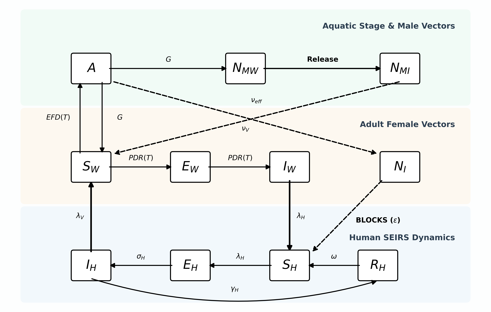
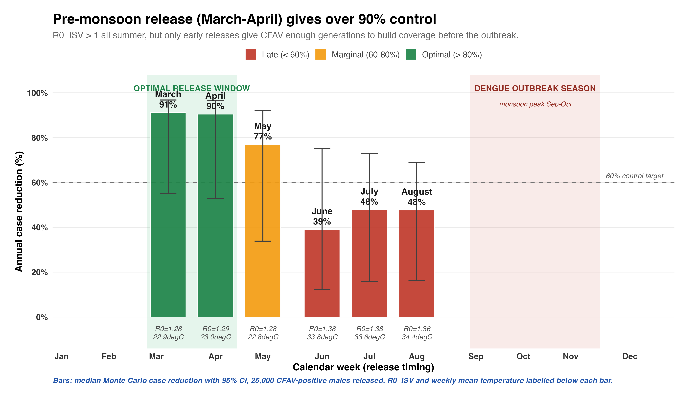
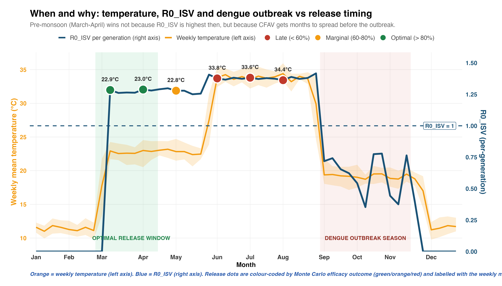

# Weather-Driven SEIRS-ISV Modelling for Dengue Control in Pakistan

> A mathematical study testing whether releasing CFAV-infected male *Aedes aegypti* mosquitoes **before the monsoon** can suppress dengue outbreaks in Rawalpindi, Pakistan.
>
> Author: **Ishtiaq Hussain** (PhD candidate, Strathclyde Institute of Pharmacy & Biomedical Sciences, University of Strathclyde, Glasgow)
> Supervisor: **Dr Valerie Odon**

---

## TL;DR

- Twelve years of weekly dengue case data from Rawalpindi (2013–2024) were used to calibrate a coupled human–vector SEIRS model driven by temperature and rainfall.
- An Insect-Specific Virus (CFAV — Cell-Fusing Agent Virus) layer was added on top, with three biologically measured vertical transmission routes (maternal, paternal and venereal) taken directly from Logan et al. 2022.
- The model shows CFAV can self-establish in Rawalpindi above **20.3 °C**, with a per-generation basic reproduction number **R₀,ISV = 1.21** at the city's mean temperature.
- A single pre-monsoon release of **25,000 CFAV-positive males in March** is projected to reduce annual dengue burden by a **median 91.4% (95% CI 54.6–96.7%)**.
- Sensitivity analysis (PRCC) confirms the result is driven by well-measured CFAV biology, not by ecological assumptions.

---

## Table of contents

1. [Background — why this study?](#1-background)
2. [Objectives](#2-objectives)
3. [Data](#3-data)
4. [Methodology](#4-methodology)
5. [Equations](#5-equations)
6. [Results](#6-results)
7. [Folder structure](#7-folder-structure)
8. [How to reproduce](#8-how-to-reproduce)
9. [References](#9-references)
10. [Citation and contact](#10-citation-and-contact)

---

## 1. Background

Dengue is a mosquito-borne viral disease that puts roughly **400 million people at risk every year**. It is transmitted primarily by *Aedes aegypti*, with a smaller contribution from *Aedes albopictus*. There is currently no universally effective vaccine.

In Pakistan, dengue is **endemic** and outbreaks peak during the monsoon (July–September) when warm temperatures and stagnant water create ideal mosquito breeding conditions. The current public-health response is **reactive**: chemical fogging and larval spraying happen *after* cases are already being reported in hospitals.

This study asks: *can we do something better and earlier?*

**Insect-Specific Viruses (ISVs)** are viruses that infect mosquitoes but cannot replicate in humans or vertebrates. One ISV, **CFAV (Cell-Fusing Agent Virus)**, has been shown experimentally to **interfere with dengue virus replication inside the mosquito gut**, effectively "blocking" the mosquito from transmitting dengue to humans. CFAV is naturally transmitted vertically from infected mosquitoes to their offspring and also during mating, which means it can spread through a mosquito population without ongoing intervention once introduced.

This makes CFAV a candidate for a **proactive, biological dengue control strategy**: instead of fogging the city after people are already sick, release CFAV-carrying males *before* the season, let the virus spread through the wild population via mating, and break the dengue transmission cycle at its source.

The question is when, how many, and how much it would actually help. This is what the model is designed to answer.

---

## 2. Objectives

1. **Predict** climate-driven dengue outbreaks in Rawalpindi using a weather-coupled SEIRS framework.
2. **Quantify** the optimal timing and scale of ISV releases to maximally reduce annual dengue burden.

---

## 3. Data

| File | Description |
|---|---|
| [`00_Data/D1_Weekly_Cases_Weather.xlsx`](./00_Data/D1_Weekly_Cases_Weather.xlsx) | Weekly confirmed dengue cases in Rawalpindi (2013–2024) merged with weekly mean temperature (°C) and rainfall (mm). |
| [`00_Data/D2_Population_2017_2023.xlsx`](./00_Data/D2_Population_2017_2023.xlsx) | Annual population estimates used to scale the human compartment N_H over time. |

The case data are aggregated weekly counts — no individual patient information is included.

---

## 4. Methodology

### 4.1 Model overview

The model couples three layers:

1. **Human SEIRS dynamics** — Susceptible → Exposed → Infectious → Recovered, with waning immunity.
2. **Mosquito vector dynamics** — temperature- and rainfall-driven life cycle (eggs, larvae, adults), split into wild and CFAV-infected sub-pools for both females and males.
3. **CFAV transmission kinetics** — three biologically measured vertical transmission routes combined into a single composite parameter applied at adult emergence.

The full system is shown in the compartment diagram below.



*Figure 1. Integrated SEIRS-ISV compartment diagram. Human SEIRS (blue) is coupled bidirectionally to the wild adult female mosquito SEI (orange). CFAV-infected females (N_I) block dengue transmission via the (1 − ε·p_ISV) shield. CFAV-positive males (N_MI) are introduced as a single pulse release and spread the virus through the wild population by natural mating, encoded through the composite vertical transmission probability ν_eff applied at emergence.*

### 4.2 Climate-driven human transmission

Human dengue transmission depends on temperature (which controls mosquito development and biting rate) and rainfall (which controls breeding-site availability) with biologically realistic time lags. We searched over **35 climate-lag combinations** using the **Nelder-Mead simplex algorithm** to minimise the root-mean-square error against weekly case data, identifying an **optimal 7-week rainfall lag and 6-week temperature lag**.

The human transmission force is a non-linear exponential function of the standardised lagged climate variables (Equation 2 in [Equations](#5-equations) below). The fitted parameter κ absorbs any unmodelled human dynamics (serotype shifts, mobility, host immunity heterogeneity).

### 4.3 Vector ecology — thermal traits

The mosquito side follows a temperature-dependent life cycle implemented through the thermal-trait functions of Mordecai et al. 2017:

- **EFD(T)** — eggs per female per day
- **MDR(T)** — mosquito development rate (larvae → adult)
- **pEA(T)** — probability of egg-to-adult survival
- **lf(T)** — adult female lifespan
- **PDR(T)** — pathogen development rate (extrinsic incubation rate for dengue inside the mosquito)
- **a(T)** — biting rate (per female per day)
- **c(T)** — human-to-mosquito transmission probability per bite

All thermal traits are implemented in [`01_Scripts/00_Thermal_Functions.R`](./01_Scripts/00_Thermal_Functions.R).

Aquatic stage dynamics (eggs and larvae pooled in `A`) follow a rainfall-driven carrying capacity, with recruitment to adults governed by temperature (Equations 3–5).

### 4.4 CFAV transmission biology

CFAV is transmitted vertically through three routes documented by Logan et al. 2022 in *Aedes aegypti*:

| Route | Symbol | Rate | Meaning |
|---|---|---|---|
| Maternal | ν_M | **0.93** | An infected female passes CFAV to 93% of her offspring through her eggs. |
| Paternal | ν_P | **0.76** | When an infected male mates with a wild female, 76% of her offspring become infected via his sperm. |
| Venereal | ν_V | **0.31** | When an infected male mates with a wild female, 31% of those females themselves become CFAV-positive in the body. |

These three rates are combined into a single per-offspring infection probability ν_eff weighted by the current sex-specific prevalences (Equation 8):

```
ν_eff = ν_M · p_F + ν_PV · (1 − p_F) · p_M + ν_V · p_M · (1 − p_F) · (1 − p_M)
ν_PV  = ν_P + (1 − ν_P) · ν_V · ν_M
```

where p_F and p_M are the fractions of females and males currently CFAV-positive.

ν_eff is then applied at adult emergence: a fraction ν_eff of new recruits joins the CFAV-infected female pool N_I, and (1 − ν_eff) joins the wild susceptible pool S_W. The same logic applies to males.

### 4.5 Coupled bidirectional vector–host engine

The full engine in [`01_Scripts/00_Coupled_Engine.R`](./01_Scripts/00_Coupled_Engine.R) runs the human and mosquito models **together, week by week**, exchanging information in both directions:

- **Mosquito → Human:** infectious females (I_W) drive human exposures through the climate-fitted β(t).
- **Human → Mosquito:** infectious humans (I_H) drive mosquito exposures through a Ross-Macdonald-form force of infection λ_V = a(T) · c(T) · I_H/N_H.

This closes the classic Ross-Macdonald vector-host loop. The CFAV intervention then enters through the **dengue-blocking shield** `(1 − ε · p_ISV)` applied to the human force of infection, where ε is the per-mosquito blocking efficacy and p_ISV is the fraction of wild adult females that are CFAV-positive.

### 4.6 R₀,ISV — per-generation establishment threshold

Whether CFAV can self-sustain in a wild *Ae. aegypti* population at a given temperature is governed by the **per-generation basic reproduction number** R₀,ISV — the average number of new CFAV-infected adults produced by one CFAV-infected adult over one generation.

We compute R₀,ISV as the **dominant eigenvalue of a 2×2 next-generation matrix** (Diekmann et al. 1990) whose entries combine maternal, paternal and venereal transmission rates and are scaled by the probability of surviving one gonotrophic cycle (~4 days) at the local temperature.

CFAV self-establishes (R₀,ISV > 1) above **T_c = 20.3 °C**. At Rawalpindi's mean temperature of 21.9 °C, **R₀,ISV = 1.21**, with a maximum of 1.42 at the thermal optimum.

Implementation: [`01_Scripts/05_Fig3_R0_Establishment.R`](./01_Scripts/05_Fig3_R0_Establishment.R)

### 4.7 Sensitivity analysis (PRCC)

Partial Rank Correlation Coefficient (PRCC) analysis following Marino et al. 2008 was used to rank input parameters by their influence on the predicted annual case reduction. Latin Hypercube Sampling drew N = 200 parameter sets across 12 years (= 2,400 simulations), each parameter varied independently within biologically plausible ranges.

Result: **ε** (blocking efficacy, PRCC ≈ 0.98) and **ν_M** (maternal transmission, PRCC ≈ 0.96) dominate; ecological nuisance parameters (K₀, k_R, M₀, N_release) are non-significant. This means the projected case reduction is **driven by well-characterised CFAV biology rather than by uncertain ecological choices**.

Implementation: [`01_Scripts/13_PRCC_Sensitivity.R`](./01_Scripts/13_PRCC_Sensitivity.R)

### 4.8 Monte Carlo uncertainty

For each release timing scenario (March, April, May, June, July, August), we ran **N = 2,000 Monte Carlo simulations** drawing the blocking efficacy ε from a Beta(2, 2) prior on [0.05, 0.95], propagating it through the 12-year coupled simulation, and reporting the median and 95% credible interval of the predicted annual case reduction.

Output: [`03_Results/MonteCarlo_Efficacy_N2000.csv`](./03_Results/MonteCarlo_Efficacy_N2000.csv)

---

## 5. Equations

### 5.1 Host SEIRS dynamics (discrete weekly time step)

New weekly human exposures, modified by the ISV-blocking shield:

$$E_{\text{new}}(t) = \beta_t \cdot \frac{S_{H,t} \cdot I_{H,t}}{N_{H,t}} \cdot (1 - \varepsilon \cdot p_{\text{ISV}}(t)) + \lambda$$

State updates:

$$S_{H,t+1} = S_{H,t} - E_{\text{new}}(t) + \omega R_{H,t} + \mu_H (N_{H,t} - S_{H,t})$$

$$E_{H,t+1} = E_{H,t} + E_{\text{new}}(t) - (\sigma_H + \mu_H) E_{H,t}$$

$$I_{H,t+1} = I_{H,t} + \sigma_H E_{H,t} - (\gamma_H + \mu_H) I_{H,t}$$

$$R_{H,t+1} = R_{H,t} + \gamma_H I_{H,t} - (\omega + \mu_H) R_{H,t}$$

### 5.2 Climate-driven transmission force β(t)

$$\beta_t = \kappa \cdot \exp\!\big(b_0 + b_R R_{t-7} + b_T T_{t-6} + b_{T^2} T_{t-6}^2\big)$$

### 5.3 Aquatic stage (eggs and larvae pool A)

$$A_{t+1} = A_t + \text{EFD}(T_t) \cdot 7 \cdot N_{V,F}(t) - G_t - \mu_A \cdot 7 \cdot A_t - \frac{A_t^2}{K_t}$$

Recruitment to adults:
$$G_t = \text{MDR}(T_t) \cdot \text{pEA}(T_t) \cdot 7 \cdot A_t$$

Rainfall-driven carrying capacity:
$$K_t = K_0 \cdot \exp(k_R R_{t-7})$$

### 5.4 Adult mosquito dynamics — wild vs CFAV-infected

Overwintering survival floor:
$$\text{surv}_V(T_t) = \max\!\big(\exp(-7/\text{lf}(T_t)),\ 0.20\big)$$

Female recruitment split by ν_eff:
$$S_{W,t+1} = S_{W,t} \cdot \text{surv}_V + (1 - \nu_{\text{eff}}) \cdot 0.5 \cdot G_t$$

$$N_{I,t+1} = N_{I,t} \cdot \text{surv}_V + \nu_{\text{eff}} \cdot 0.5 \cdot G_t$$

Male dynamics are identical, with the release term `Released_M(t)` added to N_MI in the intervention week.

### 5.5 Composite vertical transmission probability

$$\nu_{\text{eff}} = \nu_M p_F + \nu_{PV}(1 - p_F)p_M + \nu_V p_M (1 - p_F)(1 - p_M)$$

with the combined paternal+venereal cascade:
$$\nu_{PV} = \nu_P + (1 - \nu_P) \cdot \nu_V \cdot \nu_M$$

### 5.6 Human → mosquito feedback (Ross-Macdonald)

Daily and weekly forms:

$$\lambda_V = a(T) \cdot c(T) \cdot \frac{I_H}{N_H} \qquad p_{\text{inf},V} = 1 - \exp(-\lambda_V \cdot 7)$$

---

## 6. Results

### 6.1 Annual dengue burden in Rawalpindi (2013–2024)


*Figure 2. Annual confirmed dengue cases in Rawalpindi, 2013–2024. Total = 26,994 cases with a strong outbreak signal in 2019 and 2022.*

### 6.2 Out-of-sample validation

The model was calibrated on 2013–2022 weekly data and validated on **held-out 2023–2024 data**:

- **r_train = 0.658**
- **r_test  = 0.522**
- **Reporting fraction ρ = 19.6%** (within the 10–25% global range reported by Bhatt et al. 2013)
- **Thermal optimum 28.7 °C** — biologically plausible

### 6.3 CFAV establishment threshold


*Figure 3. Per-generation R₀,ISV as a function of temperature, computed via the 2×2 next-generation matrix. CFAV self-establishes above T_c = 20.3 °C. At Rawalpindi's mean of 21.9 °C, R₀,ISV = 1.21; maximum 1.42 at the thermal optimum.*

### 6.4 Release timing — when in the year does it matter?



*Figure 4. Annual case reduction by release timing (Monte Carlo, N = 2,000). A March release achieves a median 91.4% reduction (95% CI 54.6–96.7%). Efficacy collapses sharply for late releases (June–August: 39–48% median with much wider uncertainty).*



*Figure 5. Weekly temperature (orange, left axis) and per-generation R₀,ISV (blue, right axis), with release weeks coloured by Monte Carlo efficacy. The optimal release window sits in the pre-monsoon shoulder when temperature is just above the CFAV establishment threshold but well before the dengue outbreak season — giving CFAV enough generations to spread through the wild population before viral transmission peaks.*

### 6.5 Parameter sensitivity (PRCC)


*Figure 6. PRCC global sensitivity analysis. ε (blocking efficacy) and ν_M (maternal transmission) dominate the predicted case reduction. Ecological nuisance parameters (K₀, k_R, initial male pool M₀, release size N_release) are non-significant.*

### 6.6 Headline finding

> A single, well-timed **pre-monsoon release of 25,000 CFAV-positive male *Aedes aegypti*** in early March is projected to reduce annual dengue burden in Rawalpindi by a **median 91.4%**, driven by well-characterised CFAV biology rather than ecological assumptions.

---

## 7. Folder structure

```
testing_study/
├── 00_Data/
│   ├── D1_Weekly_Cases_Weather.xlsx     # 12 years of weekly cases + climate
│   └── D2_Population_2017_2023.xlsx     # human population time series
├── 01_Scripts/
│   ├── 00_Thermal_Functions.R           # Mordecai 2017 thermal traits
│   ├── 00_SEIR_Engine.R                 # one-way climate-driven baseline
│   ├── 00_Coupled_Engine.R              # bidirectional Ross-Macdonald engine
│   ├── 01_SEIR_Lag_Optimization.R       # Nelder-Mead lag grid search
│   ├── 02_Fig1_Annual_Burden.R          # Figure 2 of this README
│   ├── 03b_Fig2_TrainTest_Timeline.R    # train/test validation plot
│   ├── 04_ISV_Mosquito_Dynamics.R       # CFAV transmission kernel
│   ├── 05_Fig3_R0_Establishment.R       # R0_ISV via NGM (Figure 3)
│   ├── 07_Fig4_Efficacy_Violin.R        # Monte Carlo violin plot
│   ├── 08_Fig0_Compartment_Diagram_updated.py  # compartment diagram
│   ├── 13_PRCC_Sensitivity.R            # PRCC analysis (Figure 6)
│   ├── 14_Fig5_ReleaseTiming_Combined.R # bar-chart release timing
│   └── 15_Fig6_ReleaseTiming_Line.R     # line-graph release timing
├── 02_Figures/                          # All PNG outputs at 300 DPI
├── 03_Documentation/                    # Background notes and parameter tables
├── 03_Results/                          # CSV outputs (Monte Carlo, PRCC, lags)
└── README.md                            # this file
```

---

## 8. How to reproduce

### 8.1 Requirements

**R (≥ 4.2)** with packages:

```
readxl, dplyr, tidyr, ggplot2, scales, lhs, sensitivity
```

Install with:

```r
install.packages(c("readxl", "dplyr", "tidyr", "ggplot2",
                   "scales", "lhs", "sensitivity"))
```

**Python (≥ 3.9)** for the compartment diagram:

```
matplotlib
```

### 8.2 Run order

All R scripts assume the working directory is `01_Scripts/`.

```bash
cd 01_Scripts

# 1. Calibrate the human SEIRS model (Nelder-Mead lag search)
Rscript 01_SEIR_Lag_Optimization.R

# 2. Generate the burden and validation figures
Rscript 02_Fig1_Annual_Burden.R
Rscript 03b_Fig2_TrainTest_Timeline.R

# 3. R0_ISV establishment threshold
Rscript 05_Fig3_R0_Establishment.R

# 4. Monte Carlo intervention efficacy by release timing
Rscript 07_Fig4_Efficacy_Violin.R

# 5. Sensitivity analysis
Rscript 13_PRCC_Sensitivity.R

# 6. Combined release-timing figures
Rscript 14_Fig5_ReleaseTiming_Combined.R
Rscript 15_Fig6_ReleaseTiming_Line.R

# 7. Compartment diagram (Python)
python3 08_Fig0_Compartment_Diagram_updated.py
```

All figures land in `../02_Figures/`. CSV results land in `../03_Results/`.

---

## 9. References

| # | Paper | DOI |
|---|---|---|
| 1 | World dengue burden, 2025 update | [10.1186/s12879-025-11435-y](https://doi.org/10.1186/s12879-025-11435-y) |
| 2 | Mordecai et al. 2017, *PLOS NTD* — thermal traits of *Ae. aegypti* | [10.1371/journal.pntd.0005568](https://doi.org/10.1371/journal.pntd.0005568) |
| 3 | Bhatt et al. 2013, *Nature* — global distribution and burden of dengue | [10.1038/nature12060](https://doi.org/10.1038/nature12060) |
| 4 | Baidaliuk et al. 2019, *J. Virology* — CFAV–dengue interference in mosquitoes | [10.1128/JVI.00705-19](https://doi.org/10.1128/JVI.00705-19) |
| 5 | Focks et al. 1995, *Am. J. Trop. Med. Hyg.* — *Ae. aegypti* carrying capacity | [10.4269/ajtmh.1995.53.489](https://doi.org/10.4269/ajtmh.1995.53.489) |
| 6 | Wesolowski et al. 2015, *PNAS* — dengue importation and mobility in Pakistan | [10.1073/pnas.1504964112](https://doi.org/10.1073/pnas.1504964112) |
| 7 | Logan et al. 2022, *Applied and Environmental Microbiology* — CFAV vertical transmission rates in *Ae. aegypti* | [10.1128/aem.01062-22](https://doi.org/10.1128/aem.01062-22) |

Methodological references used but not cited on the poster:

- **Diekmann, Heesterbeek, Metz (1990)** — *J. Math. Biology* 28:365-382 — Next-Generation Matrix for R₀.
- **Marino et al. (2008)** — *J. Theor. Biology* 254:178-196 — PRCC sensitivity analysis methodology.
- **Ross & Macdonald (1957)** — *The Mathematics of Malaria* — bidirectional vector-host coupling.

---

## 10. Citation and contact

If you use any part of this work, please cite:

> Hussain, I. and Odon, V. (2026). *Weather-Driven SEIRS-ISV Modelling for Dengue Control in Pakistan: A Rawalpindi Case Study.* University of Strathclyde, Glasgow.

**Contact:**
- Ishtiaq Hussain — *ishtiaqhussain910@gmail.com*
- Strathclyde Institute of Pharmacy & Biomedical Sciences (SIPBS), Hamnett Wing, 161 Cathedral Street, Glasgow, G4 0RE, UK.

---

*This repository accompanies the poster presentation "Are Insect-Specific Viruses a Solution to the Dengue Problem?" (2026).*
